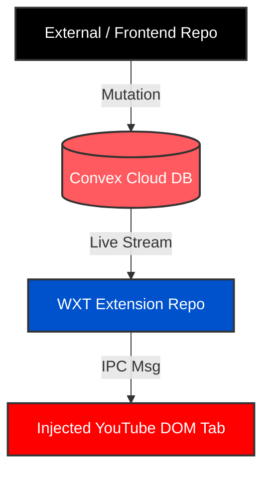

> v0.0.0

# Remote Controller Frontend UI (Convex Command Center)

**CURRENT REPOSITORY ROLE:** This is the **External Web Frontend Repo**

It provides the responsive UI (typically opened on a smartphone) that broadcasts media playing intents

## Tech Stack & Structure

- **Framework:** React Router Framework deployed serverlessly (Vercel / Cloudflare Workers)
- **State Broker:** Convex Client with standard fully reactive React state mappings

## Coding Rules & Constraints (For This Repo Only)

1. **Use Reactive React Primitives:** Unlike the extension background, this code runs natively inside a true web browser UI. You are encouraged to use standard `@convex/react` wrappers, `ConvexProvider`, and hooks like `useMutation` or `useQuery`.
2. **Enforce Payload Strictness:** Every message mutation fired through `api.commands.send` must conform exactly to the data contract the extension expects:
   - `roomId` (string)
   - `action` (string matching exactly: `"PLAY"`, `"PAUSE"`, `"NEXT"`, `"PREV"`, or `"OPEN_LINK"`)
   - `url` (optional string, supplied only when action is `"OPEN_LINK"`)
   - `timestamp` (number via `Date.now()`)
3. **Be Economical with Functions:** To safely protect the free-tier limit of 1 million free calls per month, stick strictly to discrete button clicks. Avoid hooking fast slider drag tracking states (like volume adjustments or live time sliders) directly into the Convex sync engine.

---

---

# YouTube Serverless Remote Controller (Cross-Repository Anchor)

This repository forms one half of a serverless, cross-device remote control system designed to manipulate YouTube playback. By utilizing Convex as a reactive data sync broker, this architecture eliminates the need for maintaining an always-on, stateful WebSocket backend container (like Node.js or Go).

## The Architecture & Data Flow

Instead of raw socket routing, state synchronization is treated as a fully reactive data pipeline:

1. **The External Controller Repo (Next.js/React)** pushes a command intent into a global database cloud table via a Convex mutation.
2. **The Convex Cloud Layer** instantly streams the database change event down to all matching active subscribers.
3. **The WXT Browser Extension Repo (Background Service Worker)** acts as a headless cloud subscriber, catching the live mutation update and messaging the injected content scripts to alter the target YouTube tab's DOM.

```
[ External / Frontend Repo ] ──( Mutation )──> [ Convex Cloud DB ]
                                                        │
                                                 ( Live Stream )
                                                        ▼
[ Injected YouTube DOM Tab ] <──( IPC Msg )── [ WXT Extension Repo ]
```




## Shared Contract: Database Schema

To maintain absolute strict synchronization across both repositories, any mutation pushed by the Frontend UI must map exactly to the data structure monitored by the WXT background worker.

The implicit shared table structure in Convex is defined as:

- `roomId` (string, indexed): A unique string pairing the controller device to the matching extension browser session.
- `action` (string): The media directive to execute. Allowed string literals: `"PLAY"`, `"PAUSE"`, `"NEXT"`, `"PREV"`, `"OPEN_LINK"`.
- `url` (optional string): The targeted YouTube destination to populate when `action` is set to `"OPEN_LINK"`.
- `timestamp` (number): A Unix epoch milliseconds integer checkpoint (`Date.now()`).

## Cross-Repo Architectural Constraints & Fixes

When developing or modifying either codebase, the following native platform limitations must be respected:

1. **Extension Headless Execution:** The WXT background script runs in an isolated service worker context without access to `window` or `document` objects. Therefore, it cannot utilize React hooks like `useQuery` or `ConvexProvider`. It must strictly use the standalone JavaScript client via `import { ConvexClient } from "convex/browser"`.
2. **Service Worker Dormancy:** Chrome aggressively suspends Manifest V3 service workers after roughly 30 seconds of idleness, which drops active database streams. The WXT repo solves this by using the `chrome.alarms` API to pulse every 30 seconds, ensuring the background script wakes up and verifies that the Convex database listener is live.
3. **Idempotency Execution Check:** When the extension reconnects or restarts, Convex will stream the latest document in history. To prevent re-executing an old directive (e.g., pausing a video that was paused hours ago), the extension background worker maintains an in-memory `lastExecutedTimestamp` variable. It will immediately ignore any incoming document whose timestamp is less than or equal to this checkpoint.
