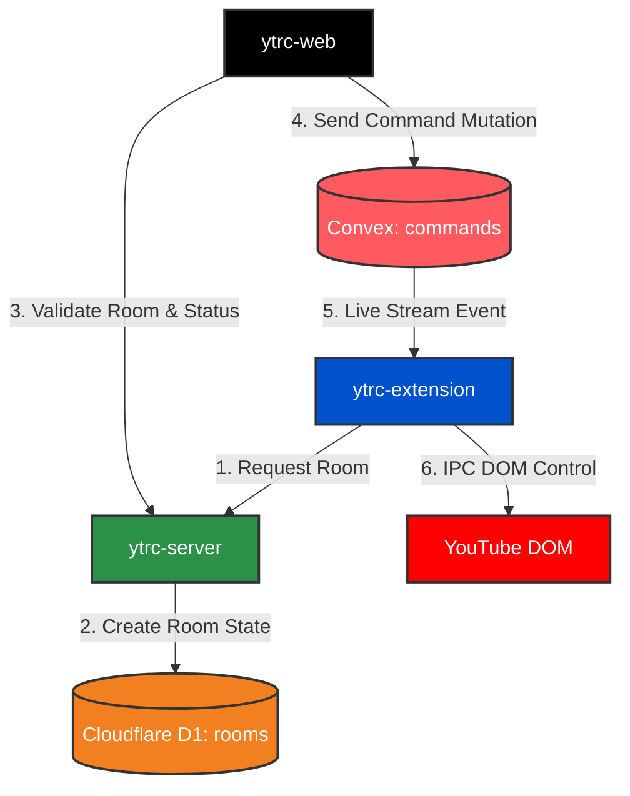

> todo: update readme and project to this for v0.1.0

> **REPOSITORY CONTEXT:** This is a universal, mirrored README shared across all repositories in this architecture. To understand the exact role of the codebase you are currently viewing, look at the `"name"` field in this repository's `package.json` file, then match it to the corresponding section under **Repository Specific Rules & Constraints** below.

---

# YouTube Serverless Remote Controller (Cross-Repo Anchor)

This project is a multi-repository system designed to seamlessly control YouTube playback across devices. To handle both persistent room states and hyper-fast remote control execution, the system employs a **CQRS (Command Query Responsibility Segregation) Hybrid Architecture**.

We split the data flow into two distinct pipelines:

1. **State & Storage (Server + D1):** The persistent ledger that handles room creation, host availability, caller fingerprinting, and security — managed by `ytrc-server` using Cloudflare D1.
2. **Real-Time Events (Convex):** The lightning-fast, ephemeral pipe used strictly to shoot execution commands to the extension.

## 📑 Table of Contents

- [The Hybrid Architecture & Data Flow](#️the-hybrid-architecture--data-flow)
  - [Phase A: The Handshake (State Flow)](#phase-a-the-handshake-state-flow)
  - [Phase B: The Remote Control (Command Flow)](#phase-b-the-remote-control-command-flow)
- [Shared Contract: Database Schemas](#️shared-contract-database-schemas)
  - [1. Cloudflare D1 (The State Ledger)](#1-cloudflare-d1-the-state-ledger)
  - [2. Convex (The Command Pipe)](#2-convex-the-command-pipe)
- [Repository Specific Rules & Constraints](#repository-specific-rules--constraints)
  - [1. ytrc-extension (WXT Chrome Extension)](#1-ytrc-extension-wxt-chrome-extension)
  - [2. ytrc-web (External Frontend UI)](#2-ytrc-web-external-frontend-ui)
  - [3. ytrc-server (External Bridge Server)](#3-ytrc-server-external-bridge-server)

---

## The Hybrid Architecture & Data Flow

### Phase A: The Handshake (State Flow)

- The **WXT Extension** boots and pings the **Server**: _"Generate a Room for me."_
- The **Server** captures the caller fingerprint (IP, User-Agent, CF headers), creates a room row in **Cloudflare D1**, and returns the `roomId`.
- The **Web Client** connects via URL (e.g., `?room=123`) and calls `GET /api/rooms/:roomId` on the **Server** to validate the room exists and the extension is currently enabled.

### Phase B: The Remote Control (Command Flow)

- The **Web Client** pushes a command intent (`"PAUSE"`) into the **Convex** `commands` table.
- **Convex** instantly streams the update to the **WXT Extension's** headless background worker.
- The **WXT Extension** validates the timestamp and executes the DOM manipulation on the YouTube tab.

---

## Shared Contract: Database Schemas

To maintain absolute strict synchronization across all repositories, the following data schemas must be respected.

### 1. Cloudflare D1 (The State Ledger)

Managed exclusively by `ytrc-server`. Other repositories must read room state through the **server API**, not directly from D1.

Table: `Room`

- `roomId` (String, Primary Key): e.g., `"A7F9-2B"` — 7-character human-readable format
- `status` (Enum): `"WAITING" | "REQUESTING_ACCESS" | "CONNECTED"`
- `extensionEnabled` (Boolean): Updates to `false` if the user disables the extension locally.
- `nowPlaying` (String / JSON-serialized): Holds current YouTube title/URL metadata.
- `createdAt` (DateTime)
- `updatedAt` (DateTime)

Table: `RoomFingerprint` (linked to `Room`)

- `id` (String, Primary Key, cuid)
- `roomId` (String, FK → Room.roomId)
- `ip` (String, Optional): Caller IP from `CF-Connecting-IP` header.
- `userAgent` (String, Optional): Caller `User-Agent` header.
- `cfCountry` (String, Optional): Cloudflare `CF-IPCountry` header.
- `cfRay` (String, Optional): Cloudflare `CF-Ray` header.
- `createdAt` (DateTime)

### Server API Contract

All consumers must use the following endpoints:

| Method | Path                 | Description                             |
| ------ | -------------------- | --------------------------------------- |
| `POST` | `/api/rooms`         | Create a new room (called by extension) |
| `GET`  | `/api/rooms/:roomId` | Get room state (called by web client)   |
| `GET`  | `/api/health/api`    | API health check                        |
| `GET`  | `/api/health/db`     | D1 connection health check              |

### 2. Convex (The Command Pipe)

Table: `commands`

- `roomId` (String, Indexed): Must match a valid `Room.roomId` in D1.
- `action` (String): Allowed literals: `"PLAY"`, `"PAUSE"`, `"NEXT"`, `"PREV"`, `"OPEN_LINK"`.
- `url` (String, Optional): The targeted YouTube destination when action is `"OPEN_LINK"`.
- `target` (String, Optional): `"NEW_TAB" | "CURRENT_TAB"`.
- `timestamp` (Number): Unix epoch milliseconds (`Date.now()`).

---

---

# Repository Specific Rules & Constraints

_When working in a specific codebase, the AI and developer must adhere to the rules below._

## 1. `ytrc-extension` (WXT Chrome Extension)

**Role:** The headless receiver and DOM manipulator.

- **Framework:** WXT with React & TypeScript.
- **NO UI Providers in Background:** The service worker (`background.ts`) has no `window` or `document` context. You **cannot** use standard React-dependent hooks like `useQuery`.
- **Headless Convex Client Only:** You must strictly pull the real-time stream using the vanilla connector: `import { ConvexClient } from "convex/browser";`.
- **Keep-Alive Loop Required:** Manifest V3 workers sleep after ~30 seconds. You must utilize the `chrome.alarms` API to pulse periodically and keep the `convex.onUpdate` listener alive.
- **Idempotency Check:** Always compare incoming Convex event timestamps against an in-memory `lastExecutedTimestamp` to avoid executing stale history items when the script re-awakens.
- **Link Validation:** Validate any `"OPEN_LINK"` payloads (e.g., ensure it matches `*://*.youtube.com/*`) before execution.

## 2. `ytrc-web` (External Frontend UI)

**Role:** The remote control interface (smartphone UI).

- **Framework:** Next.js or Vite React.
- **Read from Server, Write to Convex:** Use the `ytrc-server` REST API (`GET /api/rooms/:roomId`) to fetch room state and metadata (`nowPlaying`). Use standard `@convex/react` wrappers and `useMutation` to push interaction commands.
- **Payload Strictness:** Every mutation fired through `api.commands.send` must conform exactly to the Convex schema outlined above.
- **UI Locking:** If the server returns `extensionEnabled: false` or `status: "WAITING"`, the web UI must lock/gray out the control buttons to prevent wasteful mutations.
- **Do not read from D1 directly** — all room state goes through the server API.

## 3. `ytrc-server` (External Bridge Server)

**Role:** The lightweight state manager and security boundary.

- **Framework:** Hono on **Cloudflare Workers** (deployed via Wrangler).
- **Database:** **Cloudflare D1** (SQLite), accessed via **Prisma** with `@prisma/adapter-d1`. Schema managed via `wrangler d1 migrations`.
- **Primary Function:** Receives the initialization ping from the extension, generates secure/unique `roomId`s (format: `XXXX-XX`, uppercase alphanumeric), captures caller fingerprint metadata, and writes to D1. Acts as the sole read gateway for room state (no direct D1 access from other services).
- **Caller Fingerprinting:** Every room creation request must capture and store in `RoomFingerprint`:
  - `CF-Connecting-IP` header (real caller IP via Cloudflare)
  - `User-Agent` header
  - `CF-IPCountry` header
  - `CF-Ray` header
  - This is for traceability, not for blocking. The endpoint remains open.
- **Stateless:** This server does _not_ manage long-lived WebSockets. It strictly handles standard HTTP/REST requests.
- **No Better-Auth / No user sessions:** Authentication is not required. The server is a stateless bridge.
- **No pino:** Cloudflare Workers do not support Node.js streams. Use `console.log` / `console.error` only.
